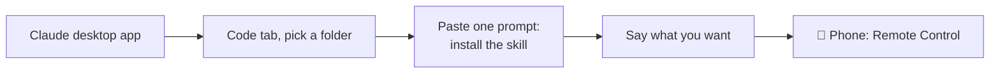

# 🐚 Shell We Begin?

### Get real work done with Claude on your own Mac, no programming and no terminal required.

---

Claude Code is an AI that can **do things on your computer**: organise files, write and format documents, build little tools for your job, and keep working while you're away. It used to live only in the terminal. Now it also lives in the normal Claude desktop app, in a tab called **Code**.

This page gets you from zero to "Claude is doing my weekly paperwork, and I can check on it from my phone" in about thirty minutes. The only thing you'll ever type is plain English.

> [!TIP]
> **Read it like a recipe.** Four steps, in order. Each one says what to click, what to paste, and what you should see.

## Who this is for

- You have a Mac and a Claude **Pro** or **Max** subscription (or you're about to get one).
- You are not a programmer and don't want to become one.
- You have a job with repeatable paperwork: client programs, reports, handouts, spreadsheets, letters.

## The path

| # | Step | What you get | Time |
|---|------|--------------|------|
| 1 | [Install the Claude app and open the Code tab](docs/01-claude-desktop.md) | Claude, running on your Mac, inside a folder you choose | 10 min |
| 2 | [Install this repo and a skill (by asking Claude)](docs/02-install-a-skill.md) | A ready-made, repeatable job Claude knows how to do | 10 min |
| 3 | [Use it from your phone](docs/03-phone.md) | Check on, steer, and talk to running sessions from anywhere | 5 min |
| 4 | [Make Claude work the way you do](docs/04-working-with-claude.md) | How to ask, how to say no, where files live, how to make your own skills | 10 min |

Keep these two handy: 📋 [**Cheat sheet**](docs/cheat-sheet.md) · 🩹 [**Troubleshooting**](docs/troubleshooting.md)

## What a skill is

A **skill** is a folder of plain-English instructions, templates, and small helper scripts. Claude reads it automatically whenever your request matches, and then does that job the same careful way every time. You install one by asking Claude to install it. You never open the folder yourself.

## Skills in this repo

| Skill | For whom | What it does |
|-------|----------|--------------|
| [`pt-client-programming`](skills/pt-client-programming/) | Physical therapists and other clinicians who write client exercise programs | Keeps one **approved** program per client, makes **surgical edits** without touching anything else, shows you a before/after review, and exports a polished handout as Word/Google Docs, PDF, and a phone-friendly web page with your header and footer. Built around a real therapist's workflow. [How to use it](skills/pt-client-programming/HOW-TO-USE.md). |

More skills will appear here over time. Have a job you repeat every week? [Open an issue](../../issues) and describe it.

## What you need

- A Mac running macOS 13 or newer (Apple menu  → About This Mac).
- A Claude account on the Pro or Max plan. The free plan doesn't include Claude Code.
- Your Mac's login password, in case macOS asks to install Apple's developer tools (one click, happens once).
- Your phone, for step 3.

## This guide grows

This is a living page. The app changes, and I learn better ways to explain things. Press **Watch** at the top to get notified when it updates, **Star** it if it helped.

## A note on safety and privacy

- Claude works inside the folder you pick for a session and, in Manual mode, asks before changing anything.
- Everything you type, and the files Claude reads, are sent to Anthropic to generate responses. Don't point it at things you wouldn't email.
- The clinical skill talks about this in detail, because health information deserves extra care. See its [README](skills/pt-client-programming/README.md#privacy).

## Prefer the terminal?

The original version of this guide, which sets up a terminal (Ghostty), fonts, a session manager (Herdr) and the command-line Claude Code, lives in [`docs/advanced-terminal/`](docs/advanced-terminal/). Everything in the skills works the same either way.

## License

MIT. Copy it, fork it, share it with your own non-technical friends.
