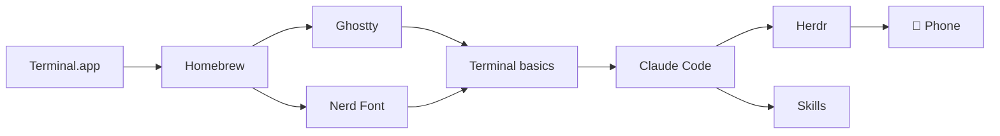

<div align="center">

# 🐚 Shell We Begin?

### A friendly, no-jargon path from *"I have never opened the terminal"* to *"I run Claude Code from my phone."*

[](#who-this-is-for)
[](docs/00-before-you-start.md)
[](https://code.claude.com/docs)
[](#this-guide-grows)

</div>

---

You do not need to be a programmer to use the most powerful AI tools that exist today.
You need a terminal, about ninety minutes, and someone to tell you *exactly* what to type.

This page is that someone.

> [!TIP]
> **Read it like a recipe.** Do the steps in order. Every step tells you what to type, what you should see, and what to do if you don't see it. You cannot break your Mac by following this guide.

## Who this is for

- You have a Mac and a Claude subscription (Pro or Max), or you're about to get one.
- You've heard of "the terminal" and it sounds like something hackers use in movies.
- You want an AI assistant that can actually **do things on your computer**: organise files, write documents, build tools for your job, and keep working while you're away from your desk.

If that's you, welcome. If you're already comfortable in a terminal, skim to [Step 5](docs/05-claude-code.md) and [Step 7](docs/07-phone-access.md).

## The path

| # | Step | What you get | Time |
|---|------|--------------|------|
| 0 | [Before you start](docs/00-before-you-start.md) | A checklist, and the two ideas that make everything else click | 5 min |
| 1 | [Meet the terminal + Homebrew](docs/01-terminal-and-homebrew.md) | Your first commands, and the "app store" that installs everything else | 15 min |
| 2 | [Ghostty](docs/02-ghostty.md) | A beautiful, fast terminal to replace the built-in one | 5 min |
| 3 | [Nerd Fonts](docs/03-nerd-fonts.md) | Icons and symbols render properly instead of as little boxes | 5 min |
| 4 | [Terminal basics](docs/04-terminal-basics.md) | `pwd`, `ls`, `cd` and friends: enough to never feel lost | 20 min |
| 5 | [Claude Code](docs/05-claude-code.md) | The AI assistant, installed, logged in, and doing its first job for you | 15 min |
| 6 | [Herdr](docs/06-herdr.md) | Sessions that keep running when you close the window | 10 min |
| 7 | [Your phone](docs/07-phone-access.md) | Check on, steer, and talk to your running sessions from anywhere | 10 min |
| 8 | [Skills](docs/08-skills.md) | Teach Claude a repeatable job, like the ones in this repo | 10 min |

Then keep these two open in a tab:

- 📋 [**Cheat sheet**](docs/cheat-sheet.md): every command and shortcut from this guide on one page
- 🩹 [**Troubleshooting**](docs/99-troubleshooting.md): the ten things that go wrong, and their fixes



## What you'll have at the end

- A terminal that looks good and feels fast.
- Claude Code installed and signed in, working inside folders you choose.
- Sessions that survive closing your laptop lid, thanks to Herdr.
- The Claude app on your phone showing those same sessions, with push notifications when Claude needs you.
- At least one **skill**: a reusable, written-down way of doing a specific job that Claude follows every time.

## Skills in this repo

Skills are folders with instructions that Claude Code reads automatically. Install one with a single command (explained in [Step 8](docs/08-skills.md)):

```bash
./scripts/install-skill.sh pt-client-programming
```

| Skill | For whom | What it does |
|-------|----------|--------------|
| [`pt-client-programming`](skills/pt-client-programming/) | Physical therapists and other clinicians who write client exercise programs | Keeps one **approved** program per client, makes **surgical edits** without touching anything else, shows you a before/after review, and exports a polished handout as Word/Google Docs, PDF, and a phone-friendly web page with your header and footer. Built around a real therapist's workflow. [How to use it](skills/pt-client-programming/HOW-TO-USE.md). |

More skills will appear here over time. Have a job you repeat every week? [Open an issue](../../issues) and describe it.

## This guide grows

This is a living page. Tools change, commands change, and I learn better ways to explain things. Press **Watch** at the top of the page to get notified when it updates, and **Star** it if it helped you.

## A note on safety and privacy

- Claude Code only works inside the folder you start it in, and asks before it changes anything (until you tell it not to).
- Everything you type, and the files Claude reads, are sent to Anthropic to generate responses. Don't point it at things you wouldn't email.
- The clinical skill in this repo talks about this in detail, because health information deserves extra care. See its [README](skills/pt-client-programming/README.md#privacy).

## License

MIT. Copy it, fork it, share it with your own non-technical friends.
